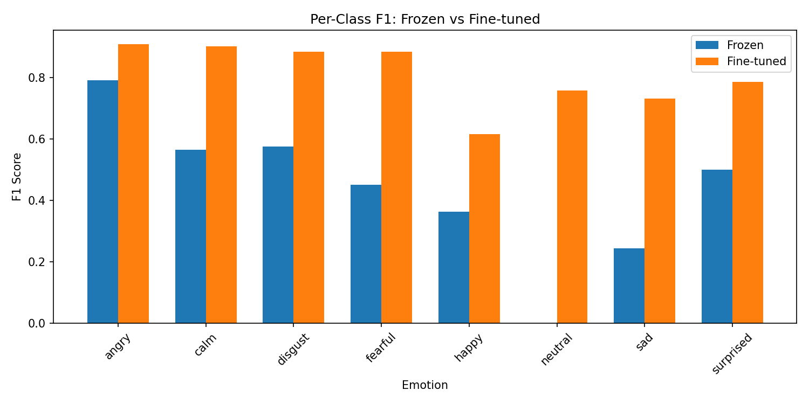
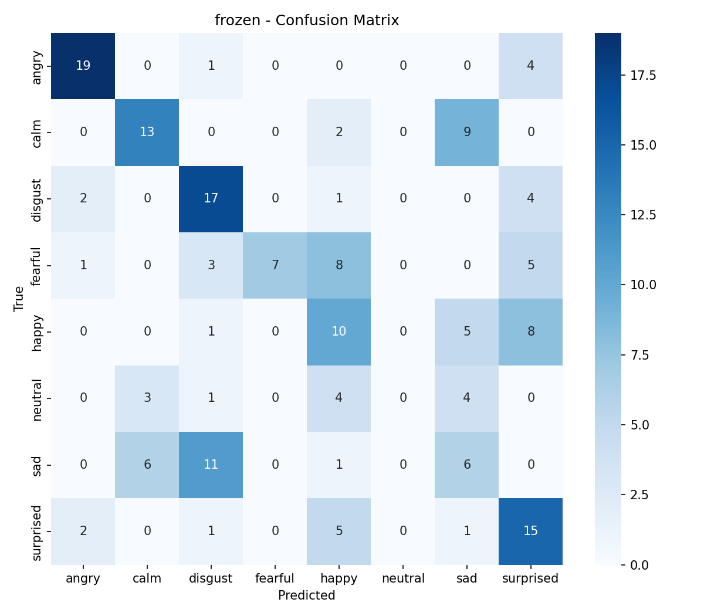
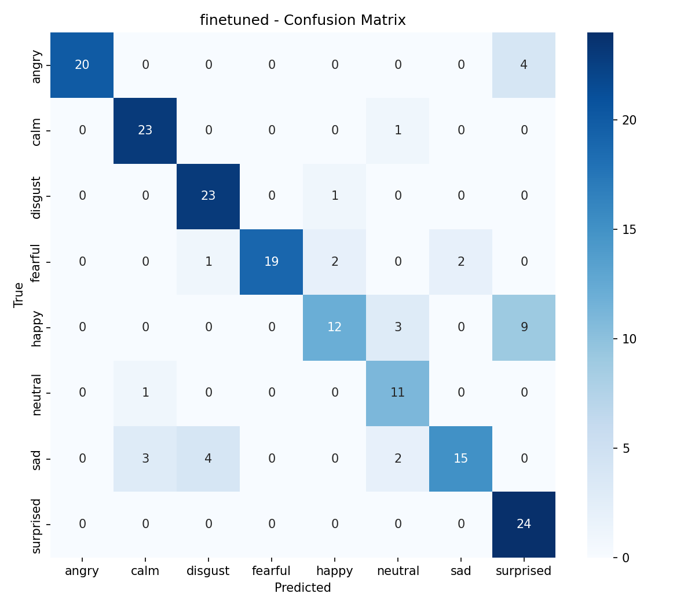
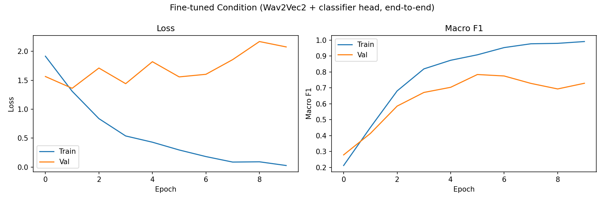
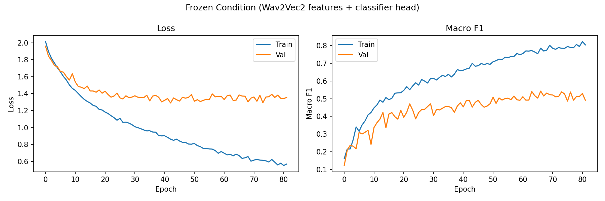

# 🍃 VibeCheck

> Speech emotion recognition with Wav2Vec2: a controlled comparison of frozen feature extraction versus end-to-end fine-tuning, plus a live web demo.

### **[🌿 Try the live demo →](https://alisazheng-vibecheck.hf.space/)**

*Record your voice in the browser, see the predicted emotion. No setup required.*



---

## What this project is

VibeCheck investigates how much **fine-tuning** a large pretrained audio model improves performance on speech emotion classification, compared to using the model as a **frozen feature extractor**. We trained both conditions on the RAVDESS dataset (1,440 clips, 24 actors, 8 emotions) using identical classifier heads, identical splits, and identical seeds — so the only experimental variable is whether Wav2Vec2's weights update during training.

We also built a Streamlit web UI (deployed on Hugging Face Spaces) that takes live microphone input or uploaded audio, runs it through the fine-tuned model, and displays the predicted emotion in real time.

### Headline results

| Metric | Frozen | Fine-tuned | Δ |
|---|---:|---:|---:|
| Accuracy | 48.3% | **81.7%** | +33.4 |
| Macro F1 | 43.8% | **80.9%** | +37.1 |

Fine-tuning Wav2Vec2 on RAVDESS produced a **37-point macro F1 improvement** over the frozen baseline. The frozen model failed entirely on the `neutral` class (F1 = 0.00); fine-tuning recovered it to F1 = 0.76. The gain is broad-based — fine-tuning improved every emotion, with the largest jumps on the harder classes (`sad`, `fearful`, `happy`).

Raw metrics in JSON form: [`results/frozen_metrics.json`](results/frozen_metrics.json), [`results/finetuned_metrics.json`](results/finetuned_metrics.json).

---

## What's in this repo

| File | What it does |
|---|---|
| `01_Train.ipynb` | Full training pipeline — downloads RAVDESS, trains both conditions, generates all the result charts. ~45–60 min on a T4 GPU. |
| `02_inference.ipynb` | Inference-only — load a trained checkpoint, predict the emotion of any audio file. Fast (~seconds). |
| `03_Streamlit.ipynb` | Launches a Streamlit web UI for live recording and prediction, with a calm earthy theme. |
| `results/` | All artifacts from training: confusion matrices, training curves, per-class F1 chart, raw metrics JSONs. |
| `LICENSE` | MIT license. |
| `.gitignore` | Tells Git which files to skip (model checkpoints, datasets, caches). |

---

## Quick start

The fastest way to try VibeCheck is the **[live demo](https://alisazheng-vibecheck.hf.space/)** — no setup at all.

If you want to dig into the code, all three notebooks are designed to run in **Google Colab** with a free T4 GPU.

### 🔬 Reproduce all the results

1. Open [`01_Train.ipynb`](01_Train.ipynb) in [Google Colab](https://colab.research.google.com)
2. Set runtime to T4 GPU (`Runtime → Change runtime type`)
3. Run all cells — the notebook downloads RAVDESS automatically and runs the full pipeline:
   - Extract Wav2Vec2 embeddings for all clips (~10 min)
   - Train the frozen baseline (~1 min)
   - Fine-tune Wav2Vec2 end-to-end (~30–60 min)
   - Generate confusion matrices, training curves, and the comparison plot


### 🎨 Run the Streamlit UI yourself

If you'd rather run the web UI locally instead of using the live demo:

1. Download `finetune_best.pt` from the link above
2. Open [`03_Streamlit.ipynb`](03_Streamlit.ipynb) in Colab
3. Set runtime to T4 GPU, run all cells — when prompted, upload the checkpoint
4. Click the public URL the last cell prints (valid for ~90 minutes per session)

---

## Methodology

### Pipeline

Both conditions share the same five-stage pipeline:

```
raw audio (16 kHz mono)
     ↓
Wav2Vec2 encoder (12 transformer layers, 95M parameters)
     ↓
mean-pool over time (~150 frames → one 768-d vector)
     ↓
classifier head (Linear → ReLU → Dropout → Linear)
     ↓
8-way softmax → predicted emotion
```

The **only difference** between conditions: in the **frozen** condition, Wav2Vec2's weights are locked and only the ~200K-parameter classifier head trains. In the **fine-tuned** condition, the entire transformer (~95M parameters) trains jointly with the head, with the convolutional feature encoder still frozen (standard practice for Wav2Vec2 fine-tuning).

### Speaker-independent splits

Actors 1–18 → train (~1080 clips), 19–21 → val (~180 clips), 22–24 → test (~180 clips). **No actor appears in more than one split.** This is essential for honest evaluation — random splits would let the model cheat by memorizing speaker-specific quirks rather than learning emotion-relevant features.

### Fine-tuning recipe

- Differential learning rates: `5e-5` for the encoder, `1e-3` for the head
- Linear warmup over the first 10% of training steps
- Gradient clipping at norm 1.0
- AdamW with weight decay 0.01
- Early stopping on validation macro F1, patience = 4 epochs

### Why macro F1?

Class imbalance matters: `neutral` only has half as many samples as the other emotions because RAVDESS has no "strong intensity" version of neutral. **Macro F1** gives equal weight to each class, while accuracy and weighted F1 over-reward correct predictions on majority classes.

---

## Detailed results

### Confusion matrices

The frozen baseline confuses `sad ↔ disgust` and `happy ↔ surprised`, and skips `neutral` entirely:



Fine-tuning produces a much cleaner diagonal — the gain is broad-based, not just from one easy class:



### Training dynamics

The fine-tuned model overfits quickly on the small dataset — train loss drops to near-zero while val loss climbs after epoch 3, with macro F1 plateauing around epoch 5. Early stopping recovers the best validation checkpoint:



The frozen baseline shows healthier training dynamics (small model on cached features, less overfitting risk) but converges to a much lower ceiling:



---

## Limitations and honest findings

The benchmark numbers above are real. But during testing on real iPhone recordings (not RAVDESS clips), we found the model performs significantly worse. This isn't a bug — it's a fundamental limitation of training on a small narrow dataset, and is itself one of the main findings of the project.

**1. Distribution shift is severe.** RAVDESS is recorded with studio microphones, by 24 professional actors, performing two scripted sentences with theatrical emotional delivery. Real-world speech recorded on a phone microphone, by an untrained speaker, with arbitrary content and natural emotional expression, is fundamentally a different distribution.

**2. Acted vs. genuine emotion are different.** RAVDESS uses *performed* emotion. The model has learned the acoustic signature of stage acting — exaggerated pitch contours, dramatic pauses, emphasized consonants — not the subtle prosodic cues of spontaneous emotion.

**3. The model has no language understanding.** Wav2Vec2 hears acoustics, not words. Saying *"I'm very happy"* in a flat tone predicts as `sad` because the words are invisible to the model — only your prosody matters.

**4. Small dataset constrains generalization.** 1,440 clips total, ~180 per emotion, only 24 speakers. Modern speech models train on thousands of hours; we fine-tuned on roughly 90 minutes of audio.

Robust real-world emotion recognition would require substantially more diverse training data (combining RAVDESS with CREMA-D, IEMOCAP, MSP-Podcast), augmentation for acoustic robustness, and likely multimodal cues (text + speech) — none of which are in scope for this project.

---

## Dataset

RAVDESS is **not included in this repo** (it's in `.gitignore`). The training notebook downloads it automatically from Zenodo. If you want to grab it manually:

- 📁 [Audio_Speech_Actors_01-24.zip](https://zenodo.org/record/1188976) (~200 MB)
- 📜 License: [CC BY-NC-SA 4.0](https://creativecommons.org/licenses/by-nc-sa/4.0/)
- 📄 Citation: Livingstone, S. R., & Russo, F. A. (2018). *The Ryerson Audio-Visual Database of Emotional Speech and Song (RAVDESS): A dynamic, multimodal set of facial and vocal expressions in North American English.* PLoS ONE, 13(5), e0196391.

## Demo Presentation

- https://www.youtube.com/watch?v=ZJFy6hIHQuc
---


## Acknowledgments

- **RAVDESS dataset**: Livingstone & Russo (2018). [Zenodo record](https://zenodo.org/record/1188976).
- **Wav2Vec2**: Baevski et al. (2020), [*Wav2Vec 2.0: A Framework for Self-Supervised Learning of Speech Representations*](https://arxiv.org/abs/2006.11477). Pretrained model `facebook/wav2vec2-base` from [Hugging Face](https://huggingface.co/facebook/wav2vec2-base).


## Authors

- Alisa Zheng · [Alisa Zheng](https://github.com/AlisaZheng11)
- Sneha Jaikumar · [Sneha Jaikumar](https://github.com/sneha-jaikumar)
- Kaushiki Singh · [kaushiki singh](https://github.com/cosecE)

## License

The code in this repository is released under the [MIT License](LICENSE). The RAVDESS dataset is separately licensed under [CC BY-NC-SA 4.0](https://creativecommons.org/licenses/by-nc-sa/4.0/) and is not redistributed here.
